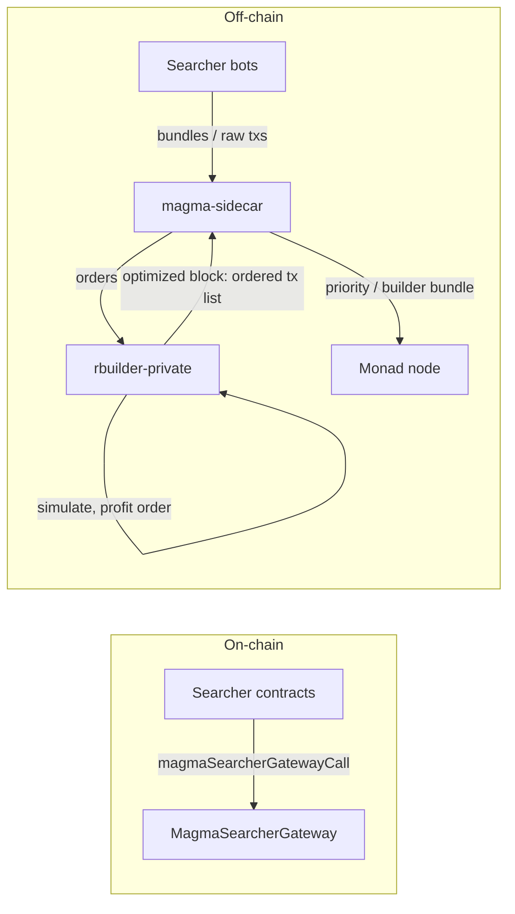

# Magma MEV architecture

This document describes how **searchers**, the **MEV gateway** (on-chain), **rbuilder**, and the **magma-sidecar** relate to **Monad** execution and transaction ordering. It is a technical overview—not a delivery timeline.

## Goals

- Collect MEV bids in a **single contract surface** (`MagmaSearcherGateway`) so fee rules are enforceable on-chain.
- Have the **block builder** optimize blocks using **native balance** accrued to that gateway (and the builder coinbase), not only coinbase tips.
- Run a **sidecar** process that sits between searchers/gateway flows and the Monad node’s tx pipeline, so bundles can be **reprioritized** (re-ordered for inclusion) using builder logic and node APIs.

## End-to-end data flow

**Outbound (priority path):** **rbuilder** produces an **optimized block**—an ordered list of transactions the builder wants executed in that sequence. It passes that to **magma-sidecar**, which forwards it to the **Monad** node so the node can **enforce that ordering** as **priority** when applying transactions to the next execution payload (rather than relying only on default mempool ordering).

**Inbound:** Searcher bundles / raw txs are ingested for simulation and profit ordering (often **via the sidecar** into rbuilder; deployment-specific).

## Components

### Searcher + MEV gateway (`mev-entrypoint`)

- **`MagmaSearcherGateway`**: entrypoint that forwards to a searcher implementation and enforces a minimum **net native-token gain** on the gateway contract balance.
- **`MagmaSearcher`** (base): authorization, gateway-only entry, and repayment of the bid to the gateway in ETH.
- Searchers implement MEV logic; **fees accumulate on the gateway** for later settlement (or future withdrawal paths), not necessarily on `block.coinbase` alone.

### Rbuilder (`rbuilder-private`)

- Fork/upstream of [Flashbots rbuilder](https://github.com/flashbots/rbuilder), adapted for Monad (e.g. **builder bundle** submission—see `MONAD_INTEGRATION.md` in that repo).
- **Execution / state**: rbuilder uses the **Monad node** as its **RPC provider** (HTTP/WebSocket to the EL JSON-RPC) for chain state, simulation, and related queries; IPC to the node may also be configured for state/mempool where supported.
- **Profit accounting**: configurable **`mev_profit_addresses`** so block building treats **Δ(balance of gateway) + Δ(builder coinbase)** as the MEV-relevant profit metric for ordering and block value.
- Exposes JSON-RPC for **`eth_sendBundle`**, **`eth_cancelBundle`**, **`eth_sendRawTransaction`** (incoming orders), and uses execution state via IPC/RPC for simulation.

### Magma sidecar (this repository)

- **Role**: sit **between rbuilder and the Monad node**: accept the **optimized block** (ordered list of txs) from rbuilder, then hand it to the node so **priority is enforced** on the execution path (builder-bundle RPC, optional txpool IPC, or other `monad-bft` hooks—deployment-specific).
- **Inbound**: ingest searcher bundles / txs and forward to rbuilder for simulation and ordering.
- **Outbound**: receive rbuilder’s **final ordered tx list** and submit to Monad so inclusion order is not overwritten by naive mempool policy alone.

**Repository boundary:** `magma-sidecar` is **not** part of the `monad-bft` Cargo workspace; it is a standalone crate. For txpool IPC it depends on `monad-eth-txpool-ipc` / `monad-eth-txpool-types` via **path dependencies** to a checkout of `monad-bft` (see [`README.md`](../README.md)). Wire formats and socket paths are defined in `monad-bft`; this repo only consumes them.

### Sidecar implementation (this repo)

The Rust binary **`magma-sidecar`** exposes HTTP endpoints documented in [`README.md`](../README.md):

- **Ingress:** `POST /rpc/rbuilder` forwards JSON-RPC to rbuilder (searchers can target the sidecar URL instead of rbuilder directly).
- **Egress:** `POST /v1/submit-builder-bundle` accepts pre-signed `monad_submitBuilderBundle` parameters and forwards them to the Monad EL JSON-RPC URL (signing remains in rbuilder).
- **Escape hatch:** `POST /rpc/monad` forwards arbitrary JSON-RPC to the node.

**Txpool IPC (optional):** with `--txpool-socket` / `MAGMA_TXPOOL_SOCKET`, the sidecar connects to the node’s txpool Unix socket (length-delimited frames, bincode event batches in, RLP `EthTxPoolIpcTx` out, as implemented in `monad-eth-txpool-ipc`). It subscribes to `EthTxPoolEvent` streams and re-injects **Insert** transactions with a configurable **priority** (`--tx-priority` / `MAGMA_TX_PRIORITY`), skipping obvious echoes of its own reinjections. This complements HTTP: you can run **HTTP-only** (no local IPC) or **HTTP + IPC** when the node exposes the socket.

The current policy is a single configurable priority; richer classification or gateway-specific rules can replace this later.

### Monad node (`monad-bft`)

- Execution, consensus, **txpool**, and RPC layers—serves as the **EL backend** that rbuilder talks to over **RPC** (and optional IPC) for building and simulation.
- Consumes the **sidecar-delivered** builder output so the **optimized ordering** becomes the effective **priority** for the next block construction path the builder controls.

## Platform topics (not specific to this repo)

These items affect **simulation quality**, **ingress**, and **reward routing**; they are tracked in Monad / builder workstreams.

### Speculative execution / realtime state (Monad)

- Better **revert protection** and simulation fidelity if the EL exposes **latest speculative state** (or equivalent) over RPC—see Monad realtime-data docs and execution/chainstate code paths.
- Requires node-side changes; aligns with “simulate against the freshest pending state.”

### Transaction ingress

- Encrypted P2P may limit visibility of raw txs; **dedicated searcher endpoints** may be required so MEV-relevant traffic is visible to the builder path.
- Tradeoff: txs that only hit public mempool may not get the same optimization unless they also go through the MEV ingress.

### Rewards: block proposer vs MEV sink

- If **block rewards** and **MEV** both accrue to a single **reward recipient**, accounting and rebates (or invoicing validators) may be needed.
- **Reward recipient** is often **static in node config**, which complicates dynamic routing; gateway + indexing + rebates are one way to separate **protocol MEV** from **validator block rewards** operationally.

## Related repos

| Repo | Role |
|------|------|
| `mev-entrypoint` | Gateway + searcher interfaces (Solidity) |
| `rbuilder-private` | Block builder, Monad bundle submission, `mev_profit_addresses` |
| `monad-bft` | Monad node; txpool, RPC, consensus |
| `magma-sidecar` (this repo) | Sidecar service interfacing rbuilder ↔ Monad |

## Glossary

| Term | Meaning |
|------|--------|
| **Gateway** | `MagmaSearcherGateway`—on-chain sink for enforced bids |
| **Reprioritizing** | Rbuilder computes order; sidecar + node **enforce** that order as priority vs default mempool ordering |
| **Aggregate profit** | Builder coinbase delta + configured gateway address deltas (rbuilder) |

---

*If you want this doc to name concrete IPC methods, RPC method names, or deployment topology (one process vs split), add those as subsections once the interfaces are frozen.*
