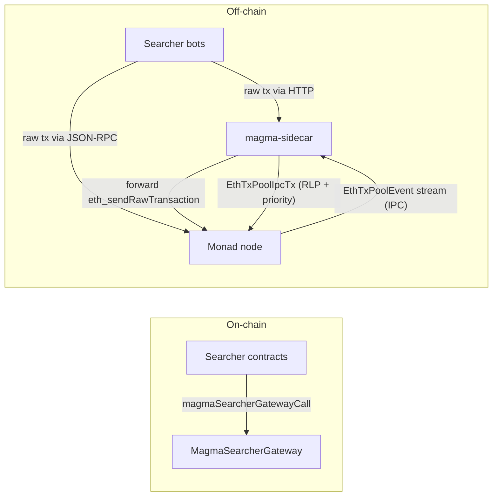

# Magma MEV architecture

This document describes how **searchers**, the **MEV gateway** (on-chain), and the **magma-sidecar** relate to **Monad** execution and transaction ordering. It is a technical overview—not a delivery timeline.

The model is **naive, tip-based MEV**: searchers compete for inclusion order through tips, and the sidecar reprioritizes the txpool accordingly.

## Goals

- Collect MEV bids in a **single contract surface** (`MagmaSearcherGateway`) so fee rules are enforceable on-chain.
- Have the **magma-sidecar** observe the node's txpool and **assign per-tx priority based on tips** (priority fee + bid paid to the gateway), so the node orders MEV-relevant txs ahead of vanilla traffic.
- Drive ordering with **tips**, enforced through the node's existing priority surface.

## End-to-end data flow

**Ingress:** Searchers submit transactions either **directly to the Monad node's JSON-RPC** or **to magma-sidecar's HTTP ingress** (which forwards into the node's RPC). Either way, they land in the node's txpool.

**Reprioritization:** magma-sidecar is connected to the node's **txpool IPC** and observes `EthTxPoolEvent`s. For each inserted transaction whose `to` is an allowlisted `MagmaSearcherGateway`, it computes a **priority** from the tx's tip (priority fee + bid declared to the gateway, decoded from `magmaSearcherGatewayCall` calldata) and re-injects the tx with that priority over IPC. Vanilla traffic (`to` not on the allowlist, or `CREATE`) is **observed but not reinjected** — the node's default ordering applies, and the sidecar does not contend with other reprioritizers (e.g. `fastlane-sidecar`) over unrelated traffic. The node uses the supplied priority when constructing the next block.



## Components

### Searcher + MEV gateway (`mev-entrypoint`)

- **`MagmaSearcherGateway`**: entrypoint that forwards to a searcher implementation and enforces a minimum **net native-token gain** on the gateway contract balance.
- **`MagmaSearcher`** (base): authorization, gateway-only entry, and repayment of the bid to the gateway in ETH.
- Searchers implement MEV logic; **fees accumulate on the gateway** for later settlement (or future withdrawal paths).
- The gateway is the on-chain anchor for the sidecar's tip computation: the `bidAmount` declared on a `magmaSearcherGatewayCall` is treated as part of that tx's effective tip when ranking it. Plain top-ups via the gateway's `receive()` are deliberately *not* credited as bids — they're operational deposits, not searcher commitments to a minimum net gain.

### Magma sidecar (this repository)

- **Role**: sit beside the Monad node, observe txpool events, and feed back tx priorities so MEV-relevant traffic is ordered ahead of vanilla traffic.
- **Ingress (HTTP)**: accept JSON-RPC from searchers (e.g. `eth_sendRawTransaction`) and forward to the Monad EL JSON-RPC, giving searchers a routing alternative to hitting the node directly.
- **Reprioritization (IPC)**: subscribe to the node's txpool over the Unix socket, classify each `Insert` event, and — only for transactions targeting an allowlisted `MagmaSearcherGateway` — compute a tip-based priority and stream the tx back over IPC with that priority. All other Insert events are observed for state tracking but left alone.

**Repository boundary:** `magma-sidecar` is a standalone Cargo project. For txpool IPC it depends on `monad-eth-txpool-ipc` / `monad-eth-txpool-types` via **path dependencies** to a sibling checkout of `monad-bft` (see [`README.md`](../README.md)). Wire formats and socket paths are defined in `monad-bft` and consumed here.

### Sidecar implementation (this repo)

The Rust binary **`magma-sidecar`** exposes HTTP endpoints documented in [`README.md`](../README.md):

- **Ingress:** `POST /rpc/monad` forwards arbitrary JSON-RPC (including `eth_sendRawTransaction`) to the Monad EL.
- **Health:** `GET /health` for liveness.

**Txpool IPC:** with `--txpool-socket` / `MAGMA_TXPOOL_SOCKET`, the sidecar connects to the node's txpool Unix socket (length-delimited frames, bincode event batches in, RLP `EthTxPoolIpcTx` out, as implemented in `monad-eth-txpool-ipc`). It subscribes to `EthTxPoolEvent` streams and re-injects **Insert** transactions whose `to` is an allowlisted `MagmaSearcherGateway` with a computed **priority**, deduplicating echoes of its own reinjections. The Monad txpool IPC server accepts multiple concurrent clients, so a validator can also run a peer reprioritizer (e.g. `fastlane-sidecar`) on the same socket; the gateway-targeted filter ensures the two services scope their priority decisions to disjoint traffic.

### Priority policy

The sidecar's priority is a **tip-based score**, applied **only to transactions whose `to` is an allowlisted `MagmaSearcherGateway`**:

```
tip(tx) = effective_priority_fee(tx) * gas_used(tx)
       + bid_routed_to_MagmaSearcherGateway(tx) * gateway_weight
```

- `effective_priority_fee` is the EIP-1559 priority fee component the validator would receive.
- `bid_routed_to_MagmaSearcherGateway` is read statically from the signed tx (already known to satisfy `to == gateway` thanks to the allowlist filter):
  - if calldata is a `magmaSearcherGatewayCall(address sender, uint256 bidAmount, address searcherContract, bytes searcherCallData)`, the sidecar decodes `bidAmount` from calldata. This is the on-chain enforced minimum net ETH gain on the gateway contract, so it is the right number to rank by — and `magmaSearcherGatewayCall` is `nonpayable`, so `tx.value` is always 0 on this path.
  - any other call to the gateway (empty calldata, a non-matching selector, a direct `receive()` top-up) gets a bid component of **zero**. We deliberately do not fall back to `tx.value`: a `receive()` deposit is an operational top-up rather than a searcher bid declared as a minimum net gain, and crediting it would let anyone buy priority by sending native value to the gateway.
- `gateway_weight` is a per-gateway multiplier (default 1) declared in the policy file; setting it to 0 keeps the gateway on the allowlist (so its txs are still scored and reinjected) but zeros out the bid component, leaving only the priority-fee contribution.

The score is mapped into the IPC priority field (a `U256`-shaped slot in `EthTxPoolIpcTx`); ordering is per-tx by tip. The plumbing is policy-agnostic, so richer policies (e.g. backrun pairing, sub-call attribution) can replace the scoring function in place.

Non-gateway traffic (`to` not on the allowlist, including `CREATE`) is **not reinjected**: the node's default txpool ordering decides where it lands. This keeps magma-sidecar narrowly scoped to MEV traffic and lets it coexist on the same `mempool.sock` with peer reprioritizers that target different ecosystems.

The `--tx-priority` constant serves as a fallback for gateway-bound txs whose computed score is exactly zero (e.g. zero priority fee, zero bid), and as the legacy "stamp every Insert" priority when the sidecar is run without `--policy-config` at all.

### Monad node (`monad-bft`)

- Execution, consensus, **txpool**, and RPC layers.
- Accepts raw transactions on JSON-RPC from any source (including the sidecar's `/rpc/monad`) and emits txpool events over IPC.
- Honors the priority supplied by the sidecar's `EthTxPoolIpcTx` reinjection when constructing the next block, so the **tip-derived ordering** becomes the effective inclusion order.

## Platform topics (not specific to this repo)

These items affect **classification quality**, **ingress**, and **reward routing**; they are tracked in Monad / platform workstreams.

### Tip classification fidelity

- The naive policy reads what is statically derivable from the signed tx: priority fee, `to`, `value`, and the `bidAmount` argument of `magmaSearcherGatewayCall`. This requires the gateway to be the direct `to` of the tx; wrapper / proxy calls that reach the gateway via a sub-call are not currently attributed.
- A future tightening: read gateway-emitted events / use `monad-bft` speculative state to attribute bid amounts post-hoc (including sub-call paths) and feed them into priority for the next block.

### Transaction ingress

- The **dedicated searcher endpoints** (sidecar HTTP and node RPC) ensure MEV-relevant traffic lands on the local txpool the sidecar is wired to, where reprioritization applies.

### Rewards: block proposer vs MEV sink

- The gateway acts as a dedicated **MEV sink**, separate from the validator's block-reward recipient; combined with indexing and rebates it lets **protocol MEV** be accounted for independently of **validator block rewards**.

## Related repos

| Repo | Role |
|------|------|
| `mev-entrypoint` | Gateway + searcher interfaces (Solidity) |
| `monad-bft` | Monad node; txpool, RPC, consensus, IPC protocol |
| `magma-sidecar` (this repo) | Sidecar service: HTTP ingress + tip-based txpool reprioritization |

## Glossary

| Term | Meaning |
|------|--------|
| **Gateway** | `MagmaSearcherGateway`—on-chain sink for enforced bids |
| **Tip** | Priority fee component + bid declared to the gateway via `magmaSearcherGatewayCall`'s `bidAmount` in the same tx (plain `receive()` top-ups are not counted as bids) |
| **Reprioritizing** | Sidecar re-injects a gateway-bound tx over IPC with a tip-derived priority so the node orders it ahead of vanilla traffic |

---

*If you want this doc to name concrete IPC methods, RPC method names, or deployment topology (one process vs split), add those as subsections once the interfaces are frozen.*
