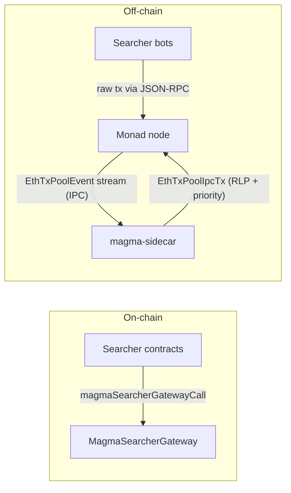

# Magma MEV architecture

This document describes how **searchers**, the **MEV gateway** (on-chain), and the **magma-sidecar** relate to **Monad** execution and transaction ordering. It is a technical overview—not a delivery timeline.

The model is **naive, tip-based MEV**: searchers compete for inclusion order through tips, and the sidecar reprioritizes the txpool accordingly.

## Goals

- Collect MEV bids in a **single contract surface** (`MagmaSearcherGateway`) so fee rules are enforceable on-chain.
- Have the **magma-sidecar** observe the node's txpool and **assign per-tx priority based on tips** (priority fee + bid paid to the gateway), so the node orders MEV-relevant txs ahead of vanilla traffic.
- Drive ordering with **tips**, enforced through the node's existing priority surface.

## End-to-end data flow

**Ingress:** Searchers submit transactions **directly to the Monad node's JSON-RPC**, and they land in the node's txpool. 

**Reprioritization:** magma-sidecar is connected to the node's **txpool IPC** and observes `EthTxPoolEvent`s. For each inserted transaction whose `to` is an allowlisted `MagmaSearcherGateway`, it computes a **priority** from the tx's tip (priority fee + bid declared to the gateway, decoded from `magmaSearcherGatewayCall` calldata) and re-injects the tx with that priority over IPC. Vanilla traffic (`to` not on the allowlist, or `CREATE`) is **observed but not reinjected** — the node's default ordering applies, and the sidecar does not contend with other reprioritizers over unrelated traffic. The node uses the supplied priority when constructing the next block.



## Components

### Searcher + MEV gateway (`mev-entrypoint`)

- **`MagmaSearcherGateway`**: entrypoint that forwards to a searcher implementation and enforces a minimum **net native-token gain** on the gateway contract balance.
- **`MagmaSearcher`** (base): authorization, gateway-only entry, and repayment of the bid to the gateway in ETH.
- Searchers implement MEV logic; **fees accumulate on the gateway** for later settlement (or future withdrawal paths).
- The gateway is the on-chain anchor for the sidecar's tip computation: the `bidAmount` declared on a `magmaSearcherGatewayCall` is treated as part of that tx's effective tip when ranking it. Plain top-ups via the gateway's `receive()` are deliberately *not* credited as bids — they're operational deposits, not searcher commitments to a minimum net gain.

### Magma sidecar (this repository)

- **Role**: sit beside the Monad node, observe txpool events, and feed back tx priorities so MEV-relevant traffic is ordered ahead of vanilla traffic.
- **Reprioritization (IPC)**: subscribe to the node's txpool over the Unix socket, classify each `Insert` event, and — only for transactions targeting an allowlisted `MagmaSearcherGateway` — compute a tip-based priority and stream the tx back over IPC with that priority. All other Insert events are observed for state tracking but left alone.
- **Observability (HTTP)**: expose `/health` and `/metrics` for liveness and Prometheus scraping.

**Repository boundary:** `magma-sidecar` is a standalone Cargo project. For txpool IPC it depends on `monad-eth-txpool-ipc` / `monad-eth-txpool-types` as **git dependencies pinned by `rev`** to the upstream `category-labs/monad-bft` repo (both crates must come from the same tree to keep the wire format in sync; see [`README.md`](../README.md)). A sibling-checkout `path` override is available for local development. Wire formats and socket paths are defined in `monad-bft` and consumed here.

### Sidecar implementation (this repo)

The Rust binary **`magma-sidecar`** exposes observability HTTP endpoints documented in [`README.md`](../README.md):

- **Health:** `GET /health` for liveness (IPC state + counters).
- **Metrics:** `GET /metrics` for Prometheus exposition.

**Txpool IPC:** with `--txpool-socket` / `MAGMA_TXPOOL_SOCKET`, the sidecar connects to the node's txpool Unix socket (length-delimited frames, bincode event batches in, RLP `EthTxPoolIpcTx` out, as implemented in `monad-eth-txpool-ipc`). It subscribes to `EthTxPoolEvent` streams and re-injects **Insert** transactions whose `to` is an allowlisted `MagmaSearcherGateway` with a computed **priority**, deduplicating echoes of its own reinjections. The Monad txpool IPC server accepts multiple concurrent clients, so a validator can also run a peer reprioritizer on the same socket; the gateway-targeted filter ensures the services scope their priority decisions to disjoint traffic.

### Priority policy

The sidecar's priority is a **tip-based score**, applied **only to transactions whose `to` is an allowlisted `MagmaSearcherGateway`**:

```
tip(tx) = effective_priority_fee(tx) * gas_limit(tx)
       + bid_routed_to_MagmaSearcherGateway(tx)
```

- `gas_limit` is a tight upper bound on `gas_used`, statically derivable from the signed tx (the sidecar scores pre-execution, so the actual `gas_used` is not yet known); see `src/policy.rs`.
- `effective_priority_fee` is the EIP-1559 priority fee component the validator would receive.
- `bid_routed_to_MagmaSearcherGateway` is read statically from the signed tx (already known to satisfy `to == gateway` thanks to the allowlist filter):
  - if calldata is a `magmaSearcherGatewayCall(address sender, uint256 bidAmount, uint64 targetBlockNumber, bytes32 targetTxHash, bool requireExclusiveSlot, address searcherContract, bytes searcherCallData)`, the sidecar decodes `bidAmount` from calldata. This is the on-chain enforced minimum net ETH gain on the gateway contract, so it is the right number to rank by. `magmaSearcherGatewayCall` is `payable`, but any `tx.value` is forwarded to the searcher (working capital), not paid to the validator, so we rank purely by the decoded `bidAmount` and do not add `tx.value`.
  - any other call to the gateway (empty calldata, a non-matching selector, a direct `receive()` top-up) gets a bid component of **zero**. We deliberately do not fall back to `tx.value`: a `receive()` deposit is an operational top-up rather than a searcher bid declared as a minimum net gain, and crediting it would let anyone buy priority by sending native value to the gateway.

Each network has exactly one allowlisted `MagmaSearcherGateway`, baked into [`src/policy.rs`](../src/policy.rs) and selected at startup with `--network` (one of `mainnet`, `testnet`, `localnet`). A gateway redeploy ships as a versioned binary rather than an out-of-band config change.

The score is mapped into the IPC priority field (a `U256`-shaped slot in `EthTxPoolIpcTx`). Top-of-block bids are ordered by this tip scalar; backrun bids use the structured encoding described in **Backrun pairing** below so they land immediately behind their target rather than being ranked absolutely.

Non-gateway traffic (`to` not the allowlisted gateway, including `CREATE`) is **not reinjected on its own**: the node's default txpool ordering decides where it lands, *unless* a backrun bid references it as a target (see below). This keeps magma-sidecar narrowly scoped to MEV traffic and lets it coexist on the same `mempool.sock` with peer reprioritizers that target different ecosystems.

The `--tx-priority-hex` constant serves as a fallback for gateway-bound txs whose computed score is exactly zero (e.g. zero priority fee, zero bid), and as the legacy "stamp every Insert" priority when the sidecar is run without `--network` at all.

### Backrun pairing

A `magmaSearcherGatewayCall` carries a `targetTxHash`. When it is zero the bid is a **lead-block (top-of-block)** bid; when it is non-zero the bid wants to execute **immediately after** the referenced target transaction (a backrun). Ranking a backrun by a flat `fee + bid` scalar is wrong: a large bid sorts *ahead of* the very tx it depends on. Backruns need **relative placement**, not absolute ranking.

The sidecar solves this by laying the 256-bit IPC priority out into fields so a target and its bids sort adjacently, with the target just above its bids:

```
TOB bid          : bit 255 = 1 | low 128 bits = fee + bid
backrun target   : bit 255 = 0 | backrun_id (bits 254..129) | bit 128 = 1
backrun bid      : bit 255 = 0 | backrun_id (bits 254..129) | bit 128 = 0 | low 128 = fee + bid
```

`backrun_id` is the top 126 bits of the target tx hash, computed identically by the target and every bid that references it. Consequences:

- Any TOB bid (`>= 2^255`) outranks every backrun group (`< 2^255`).
- Within a group the target (opportunity bit set) sits just above its bids.
- Competing bids on the same target self-order by the **same `fee + bid` scalar TOB uses** — i.e. by total realized validator value (`priority_fee * gas_limit + bidAmount`) — directly behind the target. The bid seated behind the target is the one that pays the proposer the most, whether that value arrives via the gateway bid or via gas. (This is the validator-revenue-maximizing choice; if the protocol later wanted to force value through the taxed `bidAmount` channel, this is the line to change.)
- Vanilla node-default priorities are small and sort below everything structured here.

To pair a bid with its target the sidecar keeps a small, TTL-bounded state in [`src/backrun.rs`](../src/backrun.rs): a cache of recently-seen txs (candidate targets) and an index of bids parked awaiting their target. Matching is **arrival-order independent** — if the bid arrives first it is parked and flushed when the target appears; if the target is already cached the pair is streamed immediately. When a backrun is paired, the sidecar reinjects **both** the target (boosted to its opportunity slot) and the bid. The cache TTL and capacity are configurable via `--backrun-pool-ttl-ms` / `MAGMA_BACKRUN_POOL_TTL_MS` and `--backrun-pool-max` / `MAGMA_BACKRUN_POOL_MAX`.

Pairing activity is surfaced on both `/health` and `/metrics`. The Prometheus metric names are `backrun_pairs_matched_total`, `backrun_bids_pended_total`, `backrun_bids_expired_total`, and the `backrun_pending` / `backrun_cache` gauges; the `/health` JSON uses slightly different keys (`backrun_pairs_matched`, `backrun_bids_pending`, `backrun_bids_expired`).

This is deliberately more active than a reprioritizer that only pairs when the target is already pooled at bid time, never re-scans, and does not manage competing bids: magma matches arrival-order-independently and actively ranks competing bids behind their target.

### Monad node (`monad-bft`)

- Execution, consensus, **txpool**, and RPC layers.
- Accepts raw transactions on JSON-RPC directly from searchers and emits txpool events over IPC.
- Honors the priority supplied by the sidecar's `EthTxPoolIpcTx` reinjection when constructing the next block, so the **tip-derived ordering** becomes the effective inclusion order.

## Platform topics (not specific to this repo)

These items affect **classification quality**, **ingress**, and **reward routing**; they are tracked in Monad / platform workstreams.

### Tip classification fidelity

- The naive policy reads what is statically derivable from the signed tx: priority fee, `to`, `value`, and the `bidAmount` argument of `magmaSearcherGatewayCall`. This requires the gateway to be the direct `to` of the tx; wrapper / proxy calls that reach the gateway via a sub-call are not currently attributed.
- A future tightening: read gateway-emitted events / use `monad-bft` speculative state to attribute bid amounts post-hoc (including sub-call paths) and feed them into priority for the next block.

### Transaction ingress

- Searchers submit to the **node's JSON-RPC** so MEV-relevant traffic lands on the local txpool the sidecar is wired to, where reprioritization applies.

### Rewards: block proposer vs MEV sink

- The gateway acts as a dedicated **MEV sink**, separate from the validator's block-reward recipient; combined with indexing and rebates it lets **protocol MEV** be accounted for independently of **validator block rewards**.

## Related repos

| Repo | Role |
|------|------|
| `mev-entrypoint` | Gateway + searcher interfaces (Solidity) |
| `monad-bft` | Monad node; txpool, RPC, consensus, IPC protocol |
| `magma-sidecar` (this repo) | Sidecar service: tip-based txpool IPC reprioritization |

## Glossary

| Term | Meaning |
|------|--------|
| **Gateway** | `MagmaSearcherGateway`—on-chain sink for enforced bids |
| **Tip** | Priority fee component + bid declared to the gateway via `magmaSearcherGatewayCall`'s `bidAmount` in the same tx (plain `receive()` top-ups are not counted as bids) |
| **Reprioritizing** | Sidecar re-injects a gateway-bound tx over IPC with a tip-derived priority so the node orders it ahead of vanilla traffic |

---

*If you want this doc to name concrete IPC methods, RPC method names, or deployment topology (one process vs split), add those as subsections once the interfaces are frozen.*
