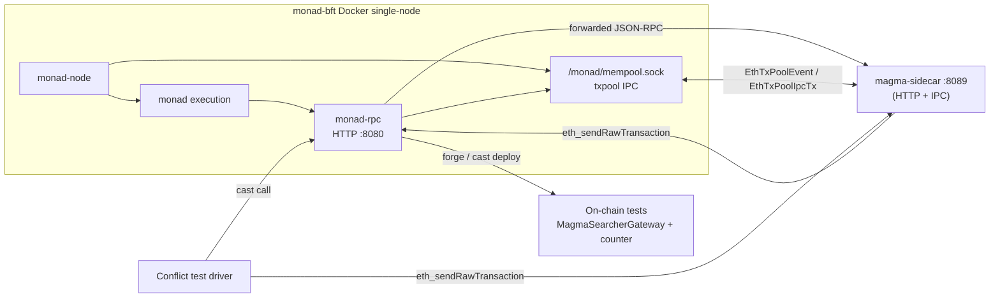

# Local development: Monad single node + magma-sidecar + Magma gateway

This guide wires together a **local Monad devnet** (single-node Docker stack), the **magma-sidecar** (HTTP ingress + txpool IPC reprioritization), and the **Magma searcher gateway** plus counter test contracts from **`mev-entrypoint`**. When everything is up, you can run the **counter-conflict** flow to exercise competing tip-bearing transactions and verify that the sidecar orders them by tip.

Paths below use these repo roots (adjust to your clone locations):

| Repo | Role |
|------|------|
| `monad-bft` | Consensus + execution + `monad-rpc` (HTTP) + txpool IPC socket |
| `magma-sidecar` (this repo) | HTTP ingress (`/rpc/monad`) + txpool IPC reprioritization |
| `mev-entrypoint` | Solidity gateway/searchers; **`test-scripts/`** = Magma gateway + counter-conflict scenario |

## Architecture



**Ports / paths (defaults)**

| Port / path | Service |
|------|---------|
| 8080 | Monad JSON-RPC (HTTP) |
| 8081 | Monad WebSocket (`eth_subscribe`) — available, not required for this flow |
| 8089 | magma-sidecar HTTP (`/rpc/monad`, `/health`) |
| `docker/single-node/node/monad/mempool.sock` | Monad txpool IPC socket — consumed by the sidecar |

## Prerequisites

- **Docker** (for `monad-bft` single-node), **Rust** toolchain, **Foundry** (`forge`, `cast`), **`jq`**
- Host tuning from [monad-bft README](https://github.com/category-labs/monad-bft) (hugepages, sysctl) if you have not already applied it
- In `monad-bft`, submodules: `git submodule update --init --recursive`

---

## 1. Start Monad single-node

From the **`monad-bft`** repository:

**Recommended (pre-built execution images):** use the upstream **`categoryxyz/monad`** images for the C++ execution stack so you avoid a long local build of `monad` / `monad-mpt`. Edit `docker/single-node/nets/compose.prebuilt.yaml` if you need different image tags, then run:

```bash
cd docker/single-node
nets/run.sh --use-prebuilt
```

**From-source build** (slower): omit `--use-prebuilt` — `nets/run.sh` will build images from the repo as in the monad-bft README.

Compose brings up `monad-node` and `monad-rpc`, exposes RPC on **8080** (HTTP) and **8081** (WS), and shares the txpool socket at **`/monad/mempool.sock`** inside the containers (mounted from `docker/single-node/node/monad/mempool.sock` on the host via the `./node` volume).

Sanity checks:

```bash
curl -s -X POST http://127.0.0.1:8080 \
  -H "Content-Type: application/json" \
  --data '{"jsonrpc":"2.0","method":"eth_chainId","params":[],"id":1}'
# expect chain id 20143 (0x4eaf)

ls docker/single-node/node/monad/mempool.sock
# expect a Unix socket
```

To reuse a previous volume and skip a full rebuild, use `nets/run.sh --cached-build <path-to-log-vol>` as described in the monad-bft README.

---

## 2. Build and run magma-sidecar

From this repo (**`magma-sidecar`**):

```bash
cd /path/to/magma-sidecar
cargo build --release
```

Run the sidecar against the local Monad node, with the mempool socket mounted into reach (the host path from §1):

```bash
MONAD_BFT_DIR=/path/to/monad-bft

cargo run --release -- \
  --bind 0.0.0.0:8089 \
  --monad-rpc-url http://127.0.0.1:8080 \
  --txpool-socket "$MONAD_BFT_DIR/docker/single-node/node/monad/mempool.sock" \
  --tx-priority 0xffff
```

Equivalent environment variables (see `README.md`):

- `MAGMA_SIDECAR_BIND` — default `127.0.0.1:8089`
- `MAGMA_MONAD_RPC_URL` — Monad JSON-RPC base URL
- `MAGMA_TXPOOL_SOCKET` — Unix socket path for txpool IPC
- `MAGMA_TX_PRIORITY` — fallback hex priority for outbound `EthTxPoolIpcTx` (default `0xffff`)
- `RUST_LOG` — e.g. `info,magma_sidecar=debug`

Verify:

```bash
curl -s http://127.0.0.1:8089/health
# {"status":"ok",...}

curl -s -X POST http://127.0.0.1:8089/rpc/monad \
  -H 'Content-Type: application/json' \
  --data '{"jsonrpc":"2.0","method":"eth_chainId","params":[],"id":1}'
# expect 0x4eaf via Monad
```

The sidecar logs `txpool_ipc=...` when it attaches to the socket, and emits `EthTxPoolIpcTx` reinjections with a tip-derived priority for each `Insert` event it observes.

Leave this process running.

---

## 3. Deploy the Magma gateway and counter test stack

Contracts and scripts live in **`mev-entrypoint`**. The **counter-conflict** flow deploys **`MagmaSearcherGateway`**, **`BlockLimitedCounter`**, and two **`MagmaTipSearcher`** instances (see `mev-entrypoint/test-scripts/README.md`).

With Monad RPC up on **8080**:

```bash
cd /path/to/mev-entrypoint/test-scripts
make build          # optional: forge + Rust CLI
make deploy
```

`make deploy` broadcasts `DeployCounterSearchers` and writes **`deployments.local.env`** with `GATEWAY`, `COUNTER`, `SEARCHER_A`, and `SEARCHER_B`. Defaults in the Makefile match Anvil-style dev keys and `RPC_URL=http://127.0.0.1:8080`.

You can target the deploy through the sidecar's `/rpc/monad` ingress instead of the node directly by overriding:

```bash
make deploy RPC_URL=http://127.0.0.1:8089/rpc/monad
```

Both paths land the deployment txs in the same Monad txpool.

---

## 4. Submit competing tip-bearing transactions

The new flow drives `MagmaTipSearcher` directly with `eth_sendRawTransaction`; the sidecar observes both txs on the txpool, scores each by **priority fee + value paid into `MagmaSearcherGateway`**, and re-injects them with that priority. Only one `increment` can land per block (`BlockLimitedCounter`), so the higher-tip tx should win.

Two ways to drive it:

### A. `cast send` (manual, no harness changes needed)

Source the deployment vars and submit two competing `execute` calls in the same block window. Direct each at the sidecar so the ingress path matches production:

```bash
cd /path/to/mev-entrypoint/test-scripts
set -a; source deployments.local.env; set +a

SIDECAR=http://127.0.0.1:8089/rpc/monad

# searcher A — tip 0.001 ETH
cast send "$SEARCHER_A" \
  "execute(uint256)" 1000000000000000 \
  --rpc-url "$SIDECAR" \
  --private-key "$PRIVATE_KEY_A" \
  --value 1000000000000000 \
  --async

# searcher B — tip 0.002 ETH
cast send "$SEARCHER_B" \
  "execute(uint256)" 2000000000000000 \
  --rpc-url "$SIDECAR" \
  --private-key "$PRIVATE_KEY_B" \
  --value 2000000000000000 \
  --async
```

Read which one landed:

```bash
make counter-read
# count() should bump by 1; lastIncrementBlock() should match the inclusion block
```

Re-run with different `--value` / function-arg pairs to confirm the higher-tip tx consistently wins.

> The `execute(uint256)` selector and value semantics here are illustrative — match them to the actual `MagmaTipSearcher` interface in `mev-entrypoint/test-scripts/contracts/MagmaTipSearcher.sol` (the on-chain entrypoint that calls `MagmaSearcherGateway` and pays `bidAmount`).

### B. `make bundles` (after harness update)

The existing `make bundles` target submits to `RBUILDER_URL` via `eth_sendBundle`. In the new architecture, that target is being repointed to submit two pre-signed `eth_sendRawTransaction`s to the sidecar's `/rpc/monad` ingress instead. Once that change lands, the workflow becomes:

```bash
cd /path/to/mev-entrypoint/test-scripts
make bundles SIDECAR_URL=http://127.0.0.1:8089/rpc/monad
make counter-read
```

Track the harness update in `mev-entrypoint/test-scripts/`.

---

## Quick reference: three terminals

1. **`monad-bft`**: `cd docker/single-node && nets/run.sh --use-prebuilt`
2. **`magma-sidecar`**: `cargo run --release -- --bind 0.0.0.0:8089 --monad-rpc-url http://127.0.0.1:8080 --txpool-socket /path/to/monad-bft/docker/single-node/node/monad/mempool.sock`
3. **Conflict test**: `cd mev-entrypoint/test-scripts && make deploy && cast send ...` (see §4)

End-to-end data path: **searcher tx → magma-sidecar `/rpc/monad`** → **Monad txpool** → **magma-sidecar reads `EthTxPoolEvent`s, scores by tip, re-injects with priority** → **node honors priority for next block** → **on-chain test contracts**.
