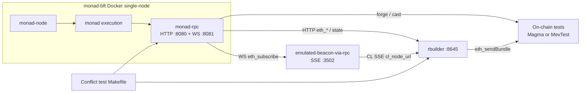

# Local development: Monad single node, emulated beacon, rbuilder, and Magma gateway

This guide wires together a **local Monad devnet** (single-node Docker stack with **WebSocket RPC**), the **emulated beacon** (subscribes to Monad over WS and exposes beacon-style SSE for rbuilder), **`rbuilder`** with the Monad-oriented config, and the **Magma searcher gateway** plus counter test contracts from **`mev-entrypoint`**. When everything is up, you can run the **counter-conflict** Makefile flow to exercise competing bundles.

Paths below use these repo roots (adjust to your clone locations):

| Repo | Role |
|------|------|
| `monad-bft` | Consensus + execution + `monad-rpc` (HTTP + WS) |
| `rbuilder-private` | `emulated-beacon-via-rpc`, `rbuilder`, `config-monad-local.toml`, optional **`mev-test-contract/rust-tester`** (MevTest + bundle Makefile) |
| `mev-entrypoint` | Solidity gateway/searchers; **`test-scripts/`** = Magma gateway + counter-conflict bundles |

There are **two** bundle-based conflict testers you may use:

| Path | Contract story | Typical commands |
|------|----------------|-------------------|
| **`mev-entrypoint/test-scripts/`** | `MagmaSearcherGateway` + shared counter + two `MagmaTipSearcher`s | `make deploy`, `make bundles`, `make counter-read` |
| **`rbuilder-private/mev-test-contract/rust-tester/`** | `MevTest.sol` + Rust tester | `make env-setup`, edit `local.env`, `make deploy-contract NETWORK=local`, `make test-bundles NETWORK=local` |

The steps below (Monad → emulated beacon → deploy → rbuilder) are shared; only the **test harness** directory differs.

## Architecture



**Ports (defaults)**

| Port | Service |
|------|---------|
| 8080 | Monad JSON-RPC (HTTP) |
| 8081 | Monad WebSocket (`eth_subscribe`; required for emulated beacon) |
| 3502 | Emulated beacon SSE (beacon-compatible events for rbuilder `cl_node_url`) |
| 8645 | rbuilder JSON-RPC (`eth_sendBundle`, builder APIs) |

## Prerequisites

- **Docker** (for `monad-bft` single-node), **Rust** toolchain, **Foundry** (`forge`, `cast`), **`jq`**
- Host tuning from [monad-bft README](https://github.com/category-labs/monad-bft) (hugepages, sysctl) if you have not already applied it
- In `monad-bft`, submodules: `git submodule update --init --recursive`

---

## 1. Start Monad single-node with WebSocket enabled

From the **`monad-bft`** repository:

**Recommended (pre-built execution images):** use the upstream **`categoryxyz/monad`** images for the C++ execution stack so you avoid a long local build of `monad` / `monad-mpt`. Edit `docker/single-node/nets/compose.prebuilt.yaml` if you need different image tags, then run:

```bash
cd docker/single-node
nets/run.sh --use-prebuilt
```

**From-source build** (slower): omit `--use-prebuilt` — `nets/run.sh` will build images from the repo as in the monad-bft README.

Either way, Compose brings up RPC on **8080** and, in current `nets/compose.yaml`, **`monad-rpc` starts with `--ws-enabled`** and maps **8081** for the WebSocket listener. That WS endpoint is what **`emulated-beacon-via-rpc`** uses (`ws://127.0.0.1:8081/` by default).

Sanity checks:

```bash
curl -s -X POST http://127.0.0.1:8080 \
  -H "Content-Type: application/json" \
  --data '{"jsonrpc":"2.0","method":"eth_chainId","params":[],"id":1}'
# expect chain id 20143 (0x4eaf)
```

To reuse a previous volume and skip a full rebuild, use `nets/run.sh --cached-build <path-to-log-vol>` as described in the monad-bft README.

---

## 2. Run emulated beacon (subscribes to Monad WS → SSE for rbuilder)

From **`rbuilder-private`** (workspace root):

```bash
cd /path/to/rbuilder-private
cargo run -p emulated-beacon-via-rpc -- --config monad-testnet
```

Config file: `crates/emulated-beacon-via-rpc/config/monad-testnet.toml`. It sets:

- `consensus_ws_url = "ws://localhost:8081/"`
- `port = 3502` (HTTP server for beacon-style SSE used as **CL** by rbuilder)

You can switch `subscription_type` between `"newHeads"` and `"monadNewHeads"` depending on whether you want finalized vs speculative heads (see `crates/emulated-beacon-via-rpc/README.md`).

Leave this process running.

---

## 3. Deploy the Magma gateway and counter test stack

Contracts and scripts live in **`mev-entrypoint`**. The **counter-conflict** flow deploys **`MagmaSearcherGateway`**, **`BlockLimitedCounter`**, and two **`MagmaTipSearcher`** instances (see `mev-entrypoint/test-scripts/README.md`).

With Monad RPC up on **8080**:

```bash
cd /path/to/mev-entrypoint/test-scripts
make build          # optional: forge + Rust CLI
make deploy
```

`make deploy` broadcasts `DeployCounterSearchers` and writes **`deployments.local.env`** with `GATEWAY`, `COUNTER`, `SEARCHER_A`, and `SEARCHER_B`. Defaults in the Makefile match Anvil-style dev keys and `RPC_URL=http://127.0.0.1:8080`.

---

## 4. Point rbuilder at Monad + emulated beacon (and your gateway)

Use **`rbuilder-private/config-monad-local.toml`**. Important fields:

- **`chain`**: `examples/config/rbuilder/monad-devnet-genesis.json` (matches devnet chain id **20143**)
- **`cl_node_url`**: `["http://127.0.0.1:3502"]` — must match the emulated beacon **HTTP** port
- **`[rpc_provider].rpc_url`**: `http://127.0.0.1:8080`
- **`mev_profit_addresses`**: set to the **`GATEWAY`** address from `deployments.local.env` so the builder attributes native ETH paid to the gateway toward MEV profit (replace the placeholder in the file if needed)

Validate and run from **`rbuilder-private`** root:

```bash
cd /path/to/rbuilder-private
cargo run -p rbuilder --bin validate-config -- --config config-monad-local.toml
cargo run -p rbuilder --bin rbuilder -- run config-monad-local.toml
```

rbuilder listens on **8645** by default (`jsonrpc_server_port`).

**Startup order:** Monad (8080/8081) → emulated beacon (3502) → deploy contracts → **update `mev_profit_addresses`** → rbuilder (8645). If you start rbuilder before deploy, restart it after updating the gateway address in the config.

---

## 5. Test a conflict (choose one harness)

### A. Magma gateway + counter (`mev-entrypoint/test-scripts`)

With **Monad**, **emulated beacon**, **rbuilder**, and **deployed contracts** from [§3](#3-deploy-the-magma-gateway-and-counter-test-stack) all running:

```bash
cd /path/to/mev-entrypoint/test-scripts
make bundles
```

This uses **`RBUILDER_URL=http://127.0.0.1:8645`** and **`RPC_URL=http://127.0.0.1:8080`** by default, loads addresses from **`deployments.local.env`**, and runs the Rust tool to submit two bundles with different tips (see Makefile `bundles` target).

Read on-chain state:

```bash
make counter-read
```

Other useful targets: `make help`, `make save-deployments` (refresh env from Foundry broadcast without redeploying).

### B. `MevTest` + Rust tester (`rbuilder-private/mev-test-contract/rust-tester`)

Submodule: ensure `mev-test-contract/lib/forge-std` is present (`git submodule update --init --recursive` in `rbuilder-private` if needed).

From **`rbuilder-private/mev-test-contract/rust-tester`**:

1. **Point `local.env` at Monad devnet** (default template uses `8545`; for this stack use **8080**):

   ```bash
   make env-setup   # once; then edit local.env
   # Set RPC_URL=http://127.0.0.1:8080 and wallet keys (see Makefile help output)
   ```

2. Deploy **`MevTest`** and run bundle tests (expects **rbuilder on 8645** — the Makefile checks with `nc` for `NETWORK=local`):

   ```bash
   make deploy-contract NETWORK=local
   make test-bundles NETWORK=local
   ```

See `make help` for `test`, `test-bundles-deploy`, and other targets. This path does **not** use `MagmaSearcherGateway`; it drives the standalone **`MevTest`** contract under `mev-test-contract/src/`.

---

## Quick reference: four terminals

1. **`monad-bft`**: `cd docker/single-node && nets/run.sh --use-prebuilt` (optional: customize `nets/compose.prebuilt.yaml`)
2. **`rbuilder-private`**: `cargo run -p emulated-beacon-via-rpc -- --config monad-testnet`
3. **`rbuilder-private`**: `cargo run -p rbuilder --bin rbuilder -- run config-monad-local.toml` (after setting `mev_profit_addresses` for the Magma path)
4. **Conflict test**: either `mev-entrypoint/test-scripts` (`make deploy` → `make bundles`) **or** `rbuilder-private/mev-test-contract/rust-tester` (`make deploy-contract NETWORK=local` → `make test-bundles NETWORK=local` with `RPC_URL` **8080**)

End-to-end data path: **WS-enabled Monad** → **emulated CL (SSE)** → **rbuilder** (payload attributes + `eth_sendBundle`) → **on-chain test contracts** → **Makefile-driven conflict run**.
