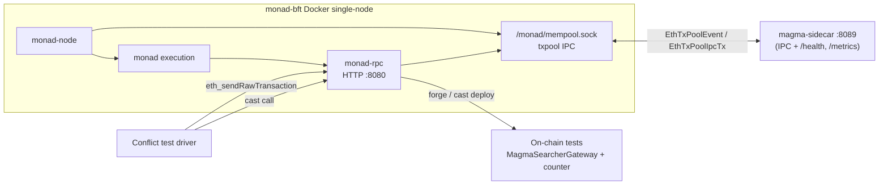

# Local development: Monad single node + magma-sidecar + Magma gateway

This guide wires together a **local Monad devnet** (single-node Docker stack), the **magma-sidecar** (txpool IPC reprioritization), and the **Magma searcher gateway** plus counter test contracts from **`mev-entrypoint`**. When everything is up, you can run the **counter-conflict** flow to exercise competing tip-bearing transactions and verify that the sidecar orders them by tip.

Paths below use these repo roots (adjust to your clone locations):

| Repo | Role |
|------|------|
| `monad-bft` | Consensus + execution + `monad-rpc` (HTTP) + txpool IPC socket |
| `magma-sidecar` (this repo) | Txpool IPC reprioritization (+ `/health`, `/metrics`) |
| `mev-entrypoint` | Solidity gateway/searchers; **`test-scripts/`** = Magma gateway + counter-conflict scenario |

## Architecture



**Ports / paths (defaults)**

| Port / path | Service |
|------|---------|
| 8080 | Monad JSON-RPC (HTTP) |
| 8081 | Monad WebSocket (`eth_subscribe`) — available, not required for this flow |
| 8089 | magma-sidecar HTTP (`/health`, `/metrics`) |
| `docker/single-node/logs/<run>/node/mempool.sock` | Monad txpool IPC socket (per-run host path) — consumed by the sidecar |

## Prerequisites

- **Docker** (for `monad-bft` single-node), **Rust** toolchain, **Foundry** (`forge`, `cast`), **`jq`**
- Host tuning from [monad-bft README](https://github.com/category-labs/monad-bft) (hugepages, sysctl) if you have not already applied it
- In `monad-bft`, submodules: `git submodule update --init --recursive`

---

## 1. Start Monad single-node

From the **`monad-bft`** repository:

**Recommended (pre-built execution images):** use the upstream **`categoryxyz/monad`** images for the C++ execution stack so you avoid a long local build of `monad` / `monad-mpt`. Edit `docker/single-node/nets/compose.prebuilt.yaml` if you need different image tags, then run:

```bash
cd docker/single-node
nets/run.sh --use-prebuilt
```

**From-source build** (slower): omit `--use-prebuilt` — `nets/run.sh` will build images from the repo as in the monad-bft README.

Compose brings up `monad-node` and `monad-rpc`, exposes RPC on **8080** (HTTP) and **8081** (WS), and shares the txpool socket at **`/monad/mempool.sock`** inside the containers. On the host, each `nets/run.sh` invocation creates a fresh per-run volume directory and mounts it as the container's `/monad`, so the socket appears on the host as `docker/single-node/logs/<YYYYMMDD_HHMMSS-hash>/node/mempool.sock`.

Sanity checks:

```bash
curl -s -X POST http://127.0.0.1:8080 \
  -H "Content-Type: application/json" \
  --data '{"jsonrpc":"2.0","method":"eth_chainId","params":[],"id":1}'
# expect chain id 20143 (0x4eaf)

# locate the socket from the most recent run:
ls -td docker/single-node/logs/*/node/mempool.sock | head -1
# expect a Unix socket
```

To reuse a previous volume and skip a full rebuild, use `nets/run.sh --cached-build <path-to-log-vol>` as described in the monad-bft README.

### 1a. Make the txpool socket reachable from the host

The execution container creates `mempool.sock` as `root:root` with mode `0755` (no `user:` mapping in `nets/compose.yaml`), and the per-run host path under `logs/<timestamp>-<hash>/node/...` typically lands at exactly **108 bytes** — one over the kernel's `AF_UNIX` `sun_path` limit of 107 usable bytes. Either alone is enough to make `connect(2)` fail; together they will produce a tight retry loop in the sidecar (`txpool IPC connect failed; retrying ...`).

After `nets/run.sh` is up, run this once per run to fix both. The repo ships a helper that finds
the newest run's socket, `chmod`s it, and (re)points the short symlink — it calls `sudo` only for
those two steps:

```bash
make link-socket            # or: ./scripts/link-txpool-socket.sh
# Override the monad-bft location if it isn't a sibling checkout:
#   MONAD_BFT_DIR=/path/to/monad-bft ./scripts/link-txpool-socket.sh
```

Equivalent manual steps, if you'd rather not use the script:

```bash
SOCK=$(ls -td /path/to/monad-bft/docker/single-node/logs/*/node/mempool.sock | head -1)

# 1. Allow your host user to connect (write bit on the socket inode)
sudo chmod 666 "$SOCK"

# 2. Expose it under a short path that fits in sun_path
sudo ln -sfn "$SOCK" /tmp/monad-mempool.sock
ls -lL /tmp/monad-mempool.sock   # sanity: srw-rw-rw-
```

The kernel resolves symlinks during pathname lookup, so only the path you pass to `connect(2)` (here `/tmp/monad-mempool.sock`, ~23 bytes) needs to fit in 108 bytes — the underlying long path on disk is fine.

> Re-run these two commands every time you do a fresh `nets/run.sh`; the new run creates a brand-new socket with default perms.

---

## 2. Build and run magma-sidecar

From this repo (**`magma-sidecar`**):

```bash
cd /path/to/magma-sidecar
cargo build --release
```

### Configure once via `.env.local`

The repo ships a committed `.env.example` template whose defaults target a **mainnet validator** (network `mainnet`, socket `/home/monad/monad-bft/mempool.sock`). Copy it to a gitignored `.env.local` and override the two values that differ for local dev. Every variable maps 1:1 to a CLI flag in `src/config.rs` (CLI > env > default), so you can also override anything ad-hoc on the command line later.

```bash
cp .env.example .env.local   # first time only; the file is gitignored
```

Edit `.env.local` for the docker single-node stack from §1:

```bash
MAGMA_NETWORK=localnet                      # local-devnet gateway baked into src/policy.rs
MAGMA_TXPOOL_SOCKET=/tmp/monad-mempool.sock # the short symlink from §1a
MAGMA_SIDECAR_BIND=0.0.0.0:8089             # optional; observability HTTP (/health, /metrics)
```

Then load it into your shell and run the sidecar with no flags:

```bash
set -a; source .env.local; set +a
cargo run --release
```

`MAGMA_NETWORK=localnet` is what activates the local-devnet gateway (the address `make deploy` in `mev-entrypoint/test-scripts/` produces for anvil account #0); leaving it at the `mainnet` default would score against the mainnet gateway, which never appears on your devnet.

A successful attach logs `connected to Monad txpool IPC path=/tmp/monad-mempool.sock`. If you see `txpool IPC connect failed; retrying`, revisit §1a — the socket either isn't writable by your user or the path you passed is over 107 bytes.

#### Override on the command line when you want to

Anything in `.env.local` is just the default — you can still override per-invocation:

```bash
cargo run --release -- --bind 0.0.0.0:9000 --txpool-socket /tmp/other.sock
```

Verify:

```bash
curl -s http://127.0.0.1:8089/health | jq
# {"status":"ok","ipc_state":"connected","tx_inserts_observed":N,"tx_prioritized":N,"tx_skipped_non_gateway":N,...}

curl -s http://127.0.0.1:8089/metrics | head
# # HELP magma_sidecar_txpool_ipc_state ...
```

The sidecar logs `txpool_ipc=...` when it attaches to the socket, and emits `EthTxPoolIpcTx` reinjections with a tip-derived priority for each `Insert` event it observes.

Leave this process running.

---

## 3. Deploy the Magma gateway and test stack

Contracts and scripts live in **`mev-entrypoint`**. `make deploy` broadcasts `DeployCounterSearchers`, which deploys the allowlisted **`MagmaSearcherGateway`**, a shared **`BlockLimitedCounter`**, four ranked **`MagmaTipSearcher`** instances, a second (intentionally *unlisted*) gateway + searcher, the backrun stack — a **`MockArbPool`** with one target and three backrun **`MagmaArbSearcher`** instances — and the ordering stack — an unbounded **`OrderCounter`** with four **`MagmaOrderSearcher`** instances (see `mev-entrypoint/test-scripts/README.md`).

With Monad RPC up on **8080**:

```bash
cd /path/to/mev-entrypoint/test-scripts
make build          # optional: forge + Rust CLI
make deploy
```

`make deploy` writes **`deployments.local.env`** with `GATEWAY`, `COUNTER`, `SEARCHER_A..D`, `UNLISTED_GATEWAY`, `UNLISTED_SEARCHER`, `ARB_POOL`, `TARGET_SEARCHER`, `BACKRUN_SEARCHER_B..D`, `ORDER_COUNTER`, and `ORDER_SEARCHER_A..D`. Defaults in the Makefile match Anvil-style dev keys and `RPC_URL=http://127.0.0.1:8080`. The `GATEWAY` it writes must match the `localnet` address baked into the sidecar's `src/policy.rs` (it does for a deterministic anvil-#0 deploy).

Deploy txs go straight to the node's RPC on `:8080`; the sidecar reprioritizes them by observing the txpool, so there's no separate endpoint to route through.

---

## 4. Run the conflict tests

The harness in `mev-entrypoint/test-scripts/` ships a set of `make test-*` targets that sign competing `magmaSearcherGatewayCall` txs and submit them via `eth_sendRawTransaction` to the node's RPC on `:8080`. The sidecar observes them on the txpool, scores each by **`gas_limit × effective_priority_fee + bidAmount`** (see `src/policy.rs`), and re-injects with that priority — which is exactly what these tests assert. Each target exits non-zero on a mismatch, so they double as CI checks.

```bash
cd /path/to/mev-entrypoint/test-scripts

make test-bundles          # one round: two competing txs; the higher bid wins the block
make test-stress           # N rounds, alternating which side bids higher (verifies both directions)
make test-ranking          # 4-way race at distinct bids, rotated each round; strict bid ordering
make test-non-gateway-noop # allowlist gate: a low bid via GATEWAY beats a higher bid via UNLISTED_GATEWAY
make test-backrun          # backrun ordering: a high-gas-price target opens a one-shot arb, and the
                           # highest-bidding backrun lands DIRECTLY below it — exercises BOTH terms of
                           # the score (gas_limit × gas_price for the target, bidAmount for the backruns)
make test-order            # full in-block ordering: N non-conflicting txs at distinct bids all succeed
                           # in one block; asserts their transaction_index is exactly descending bid
make counter-read          # read count() / lastIncrementBlock() after a counter-based run
```

Common tunables (see `test-scripts/README.md` and the Makefile): `RPC_URL`, `ROUNDS`, `TIP_*_ETHER`, `DELAY_MS`, `RECEIPT_TIMEOUT_SECS`. For example, to point at a non-default node RPC:

```bash
make test-ranking RPC_URL=http://127.0.0.1:8080
```

### Correlating with sidecar logs

Temporarily set `RUST_LOG=info,magma_sidecar=trace` when you need to correlate
individual transactions; the production/default filter is `info`:

```
TRACE magma_sidecar: reinjecting with computed priority hash=0x… priority=160000000000003000000000000000
```

and non-allowlisted traffic logs `skipping reinjection: tx not bound for an allowlisted gateway`. `make test-backrun` prints the exact `prio=` it expects per leg (in wei), so you can match those numbers against the `priority=` values in these trace lines — the target's priority should be the largest, the winning backrun's second. `make test-non-gateway-noop` is the easiest way to see the `skipping reinjection` path (the unlisted-gateway leg). The `/health` and `/metrics` counters (`tx_prioritized`, `tx_skipped_non_gateway`) move accordingly.

---

## Quick reference

Three terminals plus a one-shot fix-up after each fresh `nets/run.sh`:

1. **`monad-bft`**: `cd docker/single-node && nets/run.sh --use-prebuilt`
2. **Socket fix-up** (per fresh run, see §1a — not a long-running process): `make link-socket` (in `magma-sidecar/`)
3. **`magma-sidecar`**: `set -a; source .env.local; set +a; cargo run --release` (one-time setup: `cp .env.example .env.local`, then set `MAGMA_NETWORK=localnet` + the §1a socket path)
4. **Conflict tests**: `cd mev-entrypoint/test-scripts && make deploy && make test-bundles` (also `test-stress` / `test-ranking` / `test-non-gateway-noop` / `test-backrun` / `test-order`; see §4)

End-to-end data path: **searcher tx → Monad node RPC** → **Monad txpool** → **magma-sidecar reads `EthTxPoolEvent`s, scores by tip, re-injects with priority** → **node honors priority for next block** → **on-chain test contracts**.

---

## Troubleshooting

### Monad single-node won't start / `nets/run.sh` fails on host tuning

The node needs hugepages and enlarged UDP/TCP socket buffers before it will come
up. If `nets/run.sh` (§1) fails to start or the node crashes early, apply the
host tuning from the [monad-bft README](https://github.com/category-labs/monad-bft#getting-started)
once per boot:

```bash
# Hugepages allocation
sudo sysctl -w vm.nr_hugepages=2048
# UDP buffer sizes
sudo sysctl -w net.core.rmem_max=62500000
sudo sysctl -w net.core.rmem_default=62500000
sudo sysctl -w net.core.wmem_max=62500000
sudo sysctl -w net.core.wmem_default=62500000
# TCP buffer sizes
sudo sysctl -w net.ipv4.tcp_rmem='4096 12582912 12582912'
sudo sysctl -w net.ipv4.tcp_wmem='4096 12582912 12582912'
```

These are reset on reboot. To make them persistent, drop them in a
`/etc/sysctl.d/99-custom-monad.conf` file as described in the monad-bft README.

### `txpool IPC connect failed; retrying path=/tmp/monad-mempool.sock`

The sidecar is reaching a socket path, but `connect(2)` is being rejected. In a local single-node setup this is almost always one of three things; check them in order.

**1. Stale symlink from a previous `nets/run.sh`.** Each invocation of `nets/run.sh` mints a brand-new per-run dir under `docker/single-node/logs/<timestamp>-<hash>/node/mempool.sock` (see §1, §1a). The previous run's socket file is left on disk after its containers exit, so connecting to it fails with `ECONNREFUSED` rather than `ENOENT` — and the sidecar log just says "connect failed; retrying", not "stale symlink". Compare what the symlink points at against the currently-running containers:

```bash
# what /tmp/monad-mempool.sock currently resolves to
ls -l /tmp/monad-mempool.sock

# what's actually running right now
docker ps --format '{{.Names}}' | grep monad
# e.g. 20260505_103428-4b99f5ec7e445b1c-monad_node-1

# newest run dir on disk
ls -td /path/to/monad-bft/docker/single-node/logs/*/node/mempool.sock | head -1
```

If the timestamp/hash in the symlink target doesn't match the timestamp/hash in the container names, redo §1a against the newest run. Use `ln -sfn` (not `ln -sf`) so the symlink is replaced atomically rather than dropped *inside* the old target dir if it happens to still exist:

```bash
SOCK=$(ls -td /path/to/monad-bft/docker/single-node/logs/*/node/mempool.sock | head -1)
sudo chmod 666 "$SOCK"
sudo ln -sfn "$SOCK" /tmp/monad-mempool.sock
ls -lL /tmp/monad-mempool.sock   # expect: srw-rw-rw-
```

**2. Permissions.** The execution container creates the socket as `root:root` mode `0755` (no write bit for others), so `connect(2)` from your host user gets `EACCES`. `sudo chmod 666 "$SOCK"` from §1a fixes it; `ls -lL /tmp/monad-mempool.sock` should show `srw-rw-rw-`.

**3. `sun_path` length.** The host path `…/logs/<timestamp>-<hash>/node/mempool.sock` typically lands at exactly 108 bytes — one over the kernel's `AF_UNIX` `sun_path` limit of 107 usable bytes. Connecting via the long path fails with `ENAMETOOLONG`; the `/tmp/monad-mempool.sock` symlink (~23 bytes) is what makes it fit. If you see this error while pointing `MAGMA_TXPOOL_SOCKET` at the long path directly, switch back to the short symlink.

After any of these fixes, the sidecar should log `connected to Monad txpool IPC path=/tmp/monad-mempool.sock` on the next reconnect attempt without needing a restart.

### `/health` is reachable on `:8089` but no `Insert` events are observed

A reachable `/health` endpoint only proves the sidecar's HTTP server is up — it says nothing about the txpool IPC leg. Check `/health`:

```bash
curl -s http://127.0.0.1:8089/health | jq
```

If `ipc_state` is anything other than `"connected"`, you're back in the troubleshooting case above. If it's `"connected"` but `tx_inserts_observed` stays at 0 while you submit txs, the txs are being rejected upstream (signature, nonce, base fee, chain id) before they ever reach the pool — check `monad-rpc` logs.
